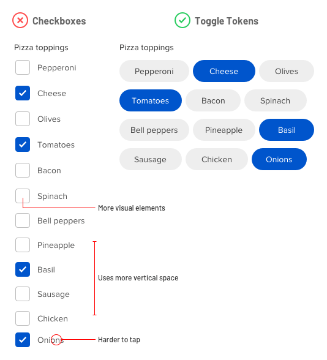

# NBRLY

Our group's final project for the Manchester Codes Software Engineering Fast Track course.

NBRLY connects you to people in your vicinity so you can find like-minded folk to have fun with.
  
See it live: https://nbrly-six.vercel.app/  
 
You can log in with our fake account:  
  
email: janet@thegoodplace.com  
password: thegoodplace  
  
---

## Tech Stack

**Front End**

- React: functional components + hooks

  _Packages_

- React Router
- Styled Components

**Backend**

- Firebase: authentication, storage bucket and firestore

**Reasoning**

We had all completed several bootcamp projects using React and wanted to now test our React skills without the course guides. Also, given the time constraints it made sense to use something we were familiar with. We had just learnt about styled components and liked how this approach tends towards modularity.

While we chose React for its familiarity, we chose Firebase in order to explore something new that we might want to use again for personal projects. And with an eye on the time we had been given for this project (2-3 weeks), we hoped Firebase would simplify creating and accessing a database and user authentication.

---

## Our Approach

We collaborated at every stage. We started off with divided out tasks - Hal and Robin came up with the designs in Figma while I invesitgated backend options. But we soon decided we would learn more if we are all involved in every part of the project and so we did most of the coding together over Zoom, alternating who was in the driving seat.

In the planning stage we wrote user stories and drew component maps. Throughout, we used Trello to break tasks into tickets and categorize them according to priority. We used Notion for shared notes and resources, like links to helpful articles and videos.

---

## Reflections and key learnings

### React

**Higher-Order Components**

A higher-order component is one that takes in another component and returns a component. We implemented this pattern with the `withAuth` component to only allow users who are signed in to access the profiles of other users and the home page. Others not signed in are re-directed back to the login page if they try to access the protected pages.

`withAuth` takes in a component, checks if the user is signed in and returns either the requested component or react router's `Redirect` component which sends the user back to the login page.

`withAuth` is then called where we export the component we want to have restricted access to, for example in Profile.js: `export default withAuth(Profile)`.

One gotcha we ran into was that we didn't pass props into our HOC and so of course all our props were received as undefined. When creating a HOC, the HOC receives a _Component_ and the component defined inside the HOC receives the _props_ of that passed in component:

```javascript
// pass Component to withAuth
const withAuth = (Component) => {
  //pass props to the component we will return
  const AuthRoute = (props) => {
    const { currentUser } = useAuth()
    if (currentUser) {
      // spread props in requested component if user is signed in
      return <Component {...props} />
    } else {
      return <Redirect to="/" />
    }
  }
  return AuthRoute
}
export default withAuth
```

**React Context**

At one point, we had all our auth related values and functions in `App.js`. With some research, we learnt that we could separate this out into a _context_ and access the current user, login and logout functions anywhere in the app without passing them as props.

This involves creating a context object with `React.createContext()`. This context object has a `Provider` React component attached to it which can wrap our app passing any data to it. We define the values we want our Provider to share in our `AuthProvider` functional component, in our case the `currentUser`, and methods `signup`, `signin` and `signout`, then pass these to the `value` prop of `AuthContext.Provider`. In `index.js` we import our `AuthProvider`, wrap `App.js` with it and then anywhere in our app we can access the data stored in the provider's `value` prop by calling our the `useContext` hook.

### Getting and using user location

The core function of NBRLY is to find nearby users with matching interests. This relies on having user location data. We found that it is possible to access device location with the [Navigator Interface](https://developer.mozilla.org/en-US/docs/Web/API/Navigator) through which we can access the [Geolocation API](https://developer.mozilla.org/en-US/docs/Web/API/Geolocation_API/Using_the_Geolocation_API). `navigator.geolocation.getCurrentPoistion` gives us the user's (device's) longitude and latutitude.

When a website attempts to access location, the browser will notify the user, and if enabled in settings, ask for permission. If the user has blocked access to location, NBRLY won't work. So we needed a way to check what the permissions are and ask the user to adjust them where necessary. Handily, the navigator object also gives us access to the [Permissions API](https://developer.mozilla.org/en-US/docs/Web/API/Permissions_API/Using_the_Permissions_API) which we can query for geolocation. Based on the result - 'granted', 'prompt', or 'denied' - NBRLY either captures the device's coordinates or notifies the user that location is needed for the site to function as intended.

### Firebase

Firebase was completely new to us so there was a natural learning curve to its implementation.
Setting up a database and handling authenticaion is hugely simplified by Firebase, which takes care of a lot of the work for you. The docs are fairly clear, although for newbies like us, lacking in helpful examples. Figuring out how to use Firebase was good experience for development where a significant portion of the job may often be understanding and using the apprporiate APIs.

Our biggest struggle came when we wanted to populate our database with dummy users. We followed a tutorial that showed how to do this from a Node.js environment. We didn't twig at first that this might create problems because we'd set everything up in a React environment, without a separated Node backend. Setting the config and initialising the Firebase app, database and auth differs ever so slightly for these 2 environments, and we broke everything trying to get the dummy users in the database. At this point we realised it might have been a good idea to build out a backend that would mediate between our UI and our Firebase utilities. A lesson for next time. In the end, we learnt that we needed to set up a service account to facilitate the script that seeds the database with fake users.

We also started off importing Firebase goodies in whichever component we needed them, straight from Firebase. This made things messy and a little confusing. After refactoring, all firebase imports are done in the config file, so we get our app, auth and database firebase objects just once in the config file, and then export them.

### Things To Improve

**UX**  
  
_Styling_  
The whole site could use some polish, but especially the Profile page needs a nice design.
In the sign up form, instead of using checkboxes, we'd like to use the toggle tokens approach:


<br><br>

_Handling Lack of Location Permissions_  
It would be great to have a button or pop up that could straight away enable the user to quickly turn on location permissions, instead of how it is currently where the user has to go into their browser preferences.


**Code**  
  
*Testing*  
We didn't take TDD approach because we could see if the site was working as intended and get by with human point-and-click testing. However, if we had adopted TDD, we may have been led into a more productive and effective mindeset. Writing out tests lends itself well to breaking down processes and clarifying understanding, leading to better organised and more readable code. It would also make it easier to keep working on the project, especially after some time has passed, by quickly highlighting where any new changes introduce errors.  
  

*Separation of concerns*  
As mentioned above, we could improve the architecture of this app by separating out UI components from functions that communicate with Firebase. If I were to start over, I'd try implementing something like the Model View Controller pattern.

---

## Things Still To Do

- [ ] Show user picture in the list view of matched users.
- [ ] Show a default icon or image on a user's profile if they have not uploaded a picture.
- [ ] Allow a user to edit their profile, and change their email or password.
- [ ] Implement an integrated chat so that users can communicate without having to give their email address over.

---

## Authors

[Anna Balquin](https://github.com/anna-m-b)  
[Robin Edwards](https://github.com/ro8inro8in)  
[Hal Fulcher](https://github.com/HalFulcher)
